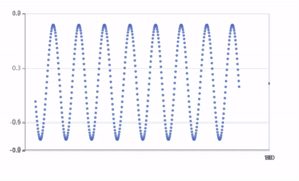

# Live Stream Data Visualization Project

## Project Description

This project demonstrates how to implement a live stream data visualization system using Flask and SocketIO for the backend (`Server.py`) and HTML with ECharts and Socket.IO for the frontend (`Client.html`). The primary goal is to stream real-time data points to a web-based interface, showcasing a dynamic and interactive way to display information, such as a continuously updating sine wave graph.




## Files Overview

### `Server.py`

**Functionality:**

- Initializes a Flask app and configures it to use SocketIO for real-time communication.
- Generates live data points, simulating a sine wave, and streams this data to connected clients.
- Uses a background thread to continuously emit data points to the frontend at 1ms intervals.

**Key Components:**

- `data_generation(count)`: A function that generates sine wave data points based on a given count.
- `background_thread()`: The core function that runs in the background to emit live stream data. This function periodically generates new data points by calling `data_generation` and emits these points to clients via the SocketIO `emit` method.

### `Client.html`

**Functionality:**

- Utilizes ECharts for rendering dynamic charts and graphs in the browser.
- Establishes a connection to the Flask-SocketIO server to receive live data updates.
- Updates the displayed chart in real-time as new data points are streamed from the server.

**Key Components:**

- HTML structure to define the visualization area.
- JavaScript code for initializing the ECharts chart, establishing a Socket.IO client connection, and handling incoming data points to update the chart dynamically.

## Live Stream Data Handling

The function responsible for handling live stream data in `Server.py` is `background_thread()`. This function generates live data points by invoking `data_generation(count)` and streams them to clients using SocketIO's `emit` method, with the event name `sin_wave`. It ensures continuous data streaming by running in an infinite loop and emitting new data at 1ms intervals, making it the backbone of the live data streaming functionality.

## Installation of Dependencies

Before running the project, you need to install the necessary dependencies. This can be done by running the following command in your terminal:

```
pip install -r requirements.txt
```

Ensure you have pip installed and your Python environment set up properly. This command will install all the required packages as specified in the `requirements.txt` file.

## Integration Guide

To integrate this live stream script into your application, ensure that both `Server.py` and `Client.html` are properly set up in your environment:

- **Backend Setup**: Modify the data_generation function in `Server.py` to retrieve the data from your system. Then Run `Server.py` to start the Flask-SocketIO server. This will begin generating and streaming live data points.
- **Frontend Setup**: Serve `Client.html` through a web server or open it in a web browser to connect to the live data stream. Make sure the Socket.IO client URL matches your server's address and port.

For detailed setup instructions and dependencies, refer to the comments within each file and ensure all required libraries are installed.
